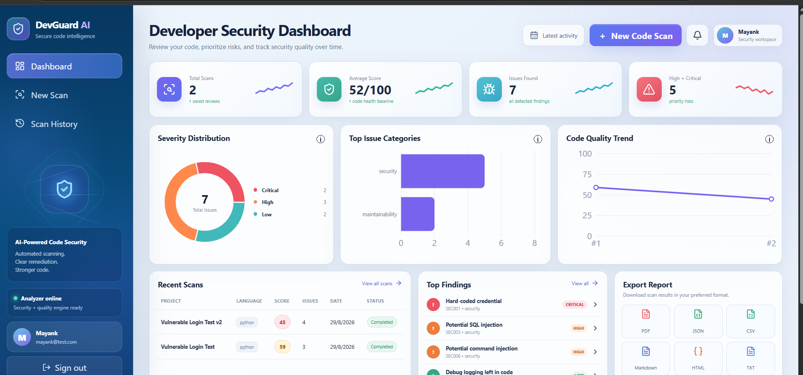
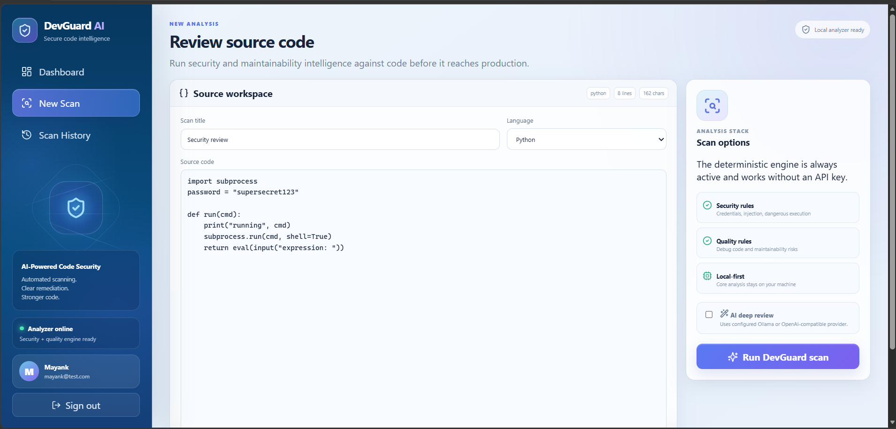
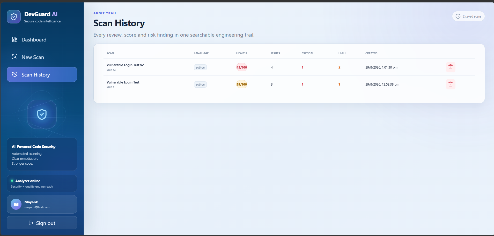
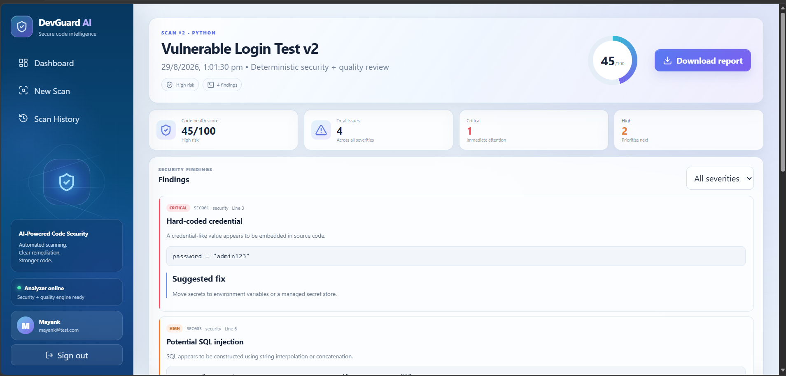
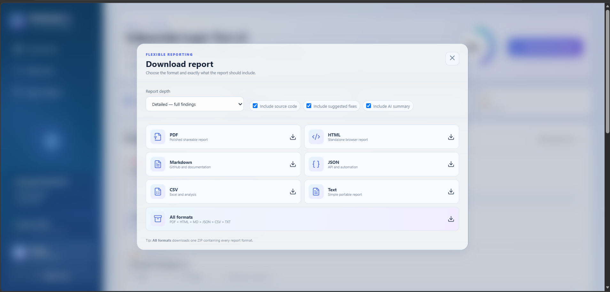
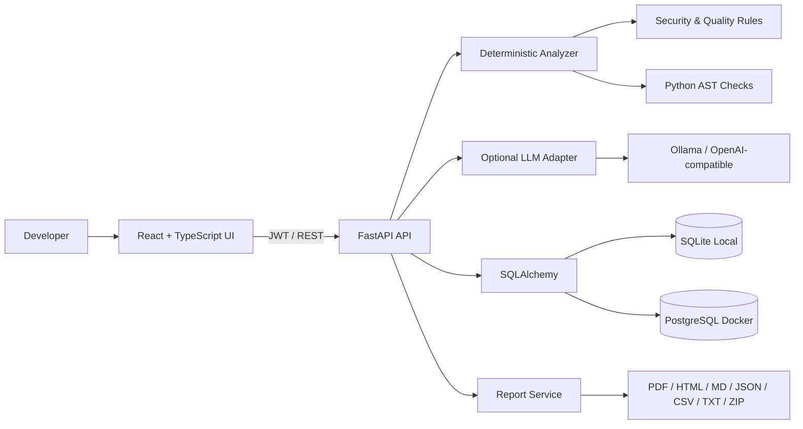

# DevGuard AI

**AI-assisted code security and quality review platform with a deterministic scanning core.**

DevGuard AI is a full-stack developer-security product built with **FastAPI, React, TypeScript, SQLAlchemy and JWT authentication**. Developers can submit source code, receive explainable security and maintainability findings, track scan history, inspect analytics, and export professional reports.

The core scanner works **without any paid API**. Optional Ollama or OpenAI-compatible integrations can add an LLM deep-review layer without making the application dependent on an LLM.



## Highlights

- Full-stack React + TypeScript + FastAPI application
- User registration/login with hashed passwords and JWT
- Deterministic static-analysis rules with explainable findings
- Python AST-based checks plus language-aware/generic rules
- Detects credentials, injection risks, dangerous execution patterns and maintainability issues
- Critical / High / Medium / Low severity classification
- Transparent 0–100 code-health score
- Line-level evidence, explanation and suggested remediation
- Persistent scan history and scan-detail pages
- Analytics dashboard with severity, category and quality trends
- Multi-format reporting: **PDF, HTML, Markdown, JSON, CSV, TXT and ZIP bundle**
- Optional AI deep review through Ollama or an OpenAI-compatible provider
- SQLite zero-config local mode and PostgreSQL Docker mode
- Swagger/OpenAPI documentation
- Automated backend tests and production frontend build verification
- Docker Compose and GitHub Actions support

## Product Walkthrough

### 1. Security dashboard

The dashboard summarizes scan volume, code-health score, detected issues, priority risks, severity distribution, issue categories, recent scans, top findings and report shortcuts.


### 2. Source-code review workspace

Developers can name a scan, choose a language, paste source code, optionally enable AI deep review, and run the deterministic security/quality engine.



### 3. Persistent audit trail

Each completed scan is stored and can be reopened later. History includes language, health score, issue count and severity counts.



### 4. Explainable findings

Results include overall health score, issue counts, severity, rule ID, source line/snippet and a suggested fix.



### 5. Flexible reporting

Reports can be exported individually or as an all-formats ZIP, with configurable report depth and content options.



## Architecture



Core data model:

```text
User 1 ───── N Scan 1 ───── N Issue
```

## Tech Stack

| Layer | Technology |
|---|---|
| Frontend | React, TypeScript, Vite, Recharts |
| Backend | Python, FastAPI, Pydantic |
| Persistence | SQLAlchemy, SQLite, PostgreSQL |
| Authentication | JWT + password hashing |
| Analysis | Deterministic rules + Python AST |
| Optional AI | Ollama / OpenAI-compatible endpoint |
| Reporting | PDF, HTML, Markdown, JSON, CSV, TXT, ZIP |
| DevOps | Docker Compose, GitHub Actions, pytest |

## Run Locally

Requirements:

- Python 3.12+
- Node.js 20+

### Backend

```bash
cd backend
python -m venv .venv
.venv\Scripts\activate
pip install -r requirements.txt
uvicorn app.main:app --reload
```

### Frontend

Open a second terminal:

```bash
cd frontend
npm install
npm run dev
```

URLs:

- Frontend: `http://localhost:5173`
- Backend: `http://localhost:8000`
- Swagger: `http://localhost:8000/docs`

Local mode automatically uses SQLite, so PostgreSQL is not required for the demo.

### Verification

```bash
cd backend
.venv\Scripts\activate
pytest
```

```bash
cd frontend
npm run build
```

## Docker / PostgreSQL

With Docker Desktop installed:

```bash
docker compose up --build
```

## Optional AI Deep Review

The deterministic scanner remains the primary, reproducible source of findings.

Example Ollama configuration in `backend/.env`:

```env
LLM_PROVIDER=ollama
OLLAMA_BASE_URL=http://localhost:11434
OLLAMA_MODEL=qwen2.5-coder:7b
```

An OpenAI-compatible endpoint can also be configured through environment variables. Never commit real API keys.

## Example Detection

A deliberately vulnerable Python sample produced:

- Hard-coded credential — **Critical**
- Potential SQL injection — **High**
- Potential command injection — **High**
- Debug logging left in code — **Low**

This resulted in a **45/100** code-health score in the final demo.

## Verification

Final local verification:

```text
Backend tests: 8 passed
Frontend: TypeScript + Vite production build passed
Overall: ALL CHECKS PASSED
```

The Vite bundle-size and Starlette/httpx messages are warnings, not build/test failures.

## Repository Structure

```text
DevGuard-AI/
├── backend/
│   ├── app/
│   │   ├── api/
│   │   ├── core/
│   │   ├── db/
│   │   ├── models/
│   │   ├── schemas/
│   │   └── services/
│   └── tests/
├── frontend/
│   └── src/
│       ├── api/
│       ├── components/
│       ├── pages/
│       └── types/
├── docs/
│   └── screenshots/
├── samples/
├── docker-compose.yml
├── LICENSE
└── README.md
```

## Resume-ready Summary

**DevGuard AI — AI-Assisted Code Security & Review Platform**  
Python • FastAPI • React • TypeScript • SQLAlchemy • PostgreSQL • JWT • Docker

> Built a full-stack developer-security platform with a deterministic static-analysis engine, explainable line-level vulnerability findings, code-health scoring, JWT authentication, analytics, persistent scan history, optional LLM review, Docker/PostgreSQL support, and multi-format security report exports.

See `docs/RESUME_POINTS.md` and `docs/INTERVIEW_PREP.md` for stronger interview-ready material.

## Current Scope / Limitations

DevGuard AI is a portfolio-grade MVP, not a replacement for enterprise SAST platforms. The scanner intentionally uses a lightweight deterministic rules engine and AST checks. Future production expansion can add repository ingestion, Semgrep/tree-sitter adapters, asynchronous job queues, RBAC, PR scanning and organization workspaces.

## License

See `LICENSE`.
