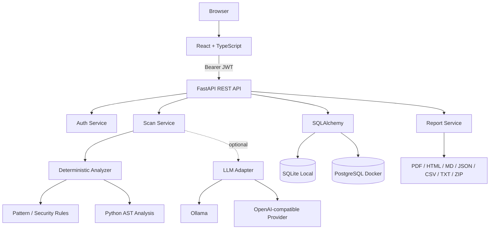

# DevGuard AI — Architecture

## Design Goal

DevGuard AI is intentionally designed so that the product **does not depend on an LLM to function**. The deterministic analyzer provides repeatable and testable findings, while an LLM is an optional enhancement layer.

## High-Level Architecture



## Request Flow

1. User registers or logs in.
2. Backend returns a signed JWT.
3. User submits code and scan metadata.
4. FastAPI validates ownership and input.
5. Deterministic analyzer runs security and quality rules.
6. Python source also receives AST-based checks.
7. Optional AI deep review can run through the configured provider.
8. Findings are normalized and the health score is calculated.
9. Scan and issues are stored through SQLAlchemy.
10. Dashboard/history endpoints aggregate persisted scans.
11. Report endpoints serialize one scan into the chosen output format.

## Data Model

```text
User
 └── Scan
      ├── source code snapshot
      ├── language
      ├── score
      ├── severity counters
      ├── optional AI summary
      └── Issue[]
           ├── rule_id
           ├── category
           ├── severity
           ├── title
           ├── description
           ├── suggestion
           ├── line
           └── snippet
```

Relationship:

`User 1 → N Scan 1 → N Issue`

## Important Design Decisions

### Deterministic-first scanning
Security findings should be reproducible. A known vulnerable input should trigger the same deterministic rules on repeated runs.

### Optional AI, not mandatory AI
LLMs are useful for richer explanation and broader reasoning, but they can be slow, unavailable or inconsistent. Keeping the primary scanner independent makes the product cheaper, easier to test and more reliable.

### SQLite + PostgreSQL
SQLite makes the local demo zero-config. PostgreSQL is available for a more production-like deployment and concurrency model.

### Explainability
A security tool is more useful when it provides the rule, severity, evidence and remediation instead of only returning a score.

### Persistence
Persisting scans makes historical analytics, audit trails and report regeneration possible.

## Security Controls

- Password hashing
- JWT authentication
- Ownership checks on scan read/delete/export actions
- Environment variables for optional provider credentials
- No required external API key
- Sensitive local `.env` and database files ignored by Git

## Scaling Path

A production-scale version could add:

- Background jobs with Celery, RQ or Temporal
- GitHub/GitLab repository ingestion
- Pull-request and diff scanning
- Semgrep, Bandit, ESLint and tree-sitter adapters
- Redis caching/rate limiting
- Object storage for large artifacts
- Organization workspaces and RBAC
- Managed PostgreSQL, backups and secrets management
- Observability and structured audit logs
